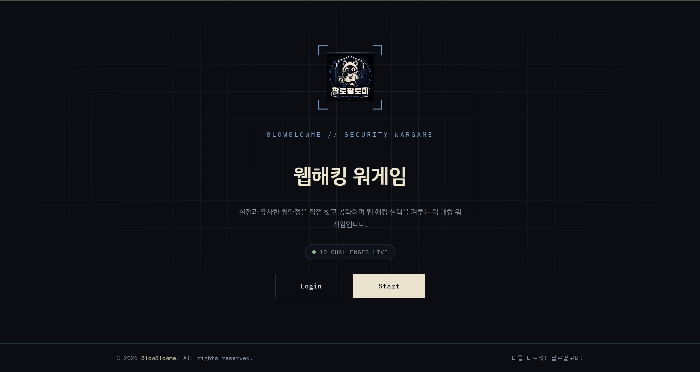

# 안녕하세요, 김혜미입니다 👋

정보보안기사 취득을 준비하며 **모의해킹(Penetration Testing) / 악성코드 분석** 분야로의 취업을 목표로 공부하고 있습니다.
공격자와 방어자의 관점을 모두 이해하는 보안 실무자가 되고자, 이론 학습과 함께 가상 환경에서의 직접적인 실습을 병행하고 있습니다.

---

## 🧑‍💻 About Me

- 🎓 서울디지털대학교 컴퓨터공학과 전공 / 경찰학과 복수전공 (2026.02 3년 조기졸업)
- 🛡️ 이스트소프트 [10기] 인프라 보안 부트캠프(국비) 수료 예정
- 🎯 목표: 정보보안기사 취득, 모의해킹 · 악성코드 분석 분야 취업
- 🖥️ VMware / VirtualBox 기반 가상 환경 실습 선호

---

## 🚀 Projects

### 🥇 2차 프로젝트 — Hotel Reservation Security Monitoring System (HRSMS)
> 5인 팀 프로젝트 (팀장/PM) · 2026.06.01 ~ 06.19 · **팀 1등 수상** (10팀 中)

- DMZ / Internal Subzone / SOC 관제망으로 분리된 인프라 설계 및 구축
- **GNS3, pfSense, Suricata**로 경계 방어 및 침입 탐지 체계 구성
- **rsyslog → Graylog** 로그 통합, **GoAccess / PMM**으로 웹·인프라 시각화
- 모의해킹으로 SQL Injection(인증우회), Open Redirection, 세션 고정, Stored XSS, IDOR, SSRF 등 **6건 취약점 발견 및 전건 조치**
- KISA 가이드 기반 67개 항목 점검 → 9건 취약점 발견 후 전건 조치, **최종 양호 67/67 달성**
- cron 기반 보안 점검 자동화 스크립트 운영 (매일 13시 실행)

### 🚩 2차 프로젝트 팀 자체 제작 CTF VM
> HRSMS와는 별도로, 같은 2차 프로젝트 기간에 팀에서 제작한 CTF 취약 VM

- 팀 자체 제작 취약 VM 머신 & 워크스루: [2nd-project-ctf-vm](./2nd-project-ctf-vm)

### 🏥 1차 프로젝트 — 차세대 통합 병원 정보 시스템 (S-HIS)
> 4인 팀 프로젝트 (팀장) · 2026.04.13 ~ 04.23

- 망 분리(의료진/행정/DB로그/DMZ) 기반 3-Tier 아키텍처 설계
- **IPsec VPN** 및 ACL 보안 정책 수립, 최소 권한 계정 관리
- **LogAnalyzer(rsyslog)** 기반 실시간 침입 탐지(로그인 성공/실패 이벤트 등) 구현

### 🎯 3차(최종) 프로젝트 & 팀 자체 워게임
> 팀 자체 제작 웹해킹 워게임: [8low8lowme](https://github.com/hyemya/3rd_project_wargame)

- 팀 자체 제작 워게임에 직접 문제 5개 출제 (Android Pattern Lock, Guide NPC, ALZ 파일 검증기 File Upload, Hidden Keys, Reflected XSS)
- 타 팀 + 멘토 출제 문제 총 100문제 전체 풀이, **팀 순위 2등**
- 워게임 파트 배점 20% **만점 획득**

### 🚩 EasyHajo CTF
- 9개 팀 출제 문제(팀당 User/Root 2플래그, 총 18점) 중 **15점 획득**

---

## 🛠️ Tools & Skills

**모의해킹 / 진단**
`Burp Suite` `sqlmap` `Nmap` `OWASP ZAP` `Metasploit(msfconsole)` `Wireshark` `Snort`

**악성코드 분석**
`OllyDbg` `PEiD` `PEStudio` `Dependency Walker` `Exeinfo PE` `HxD` `VirusTotal`

**인프라 / 시스템**
`GNS3` `pfSense` `Suricata` `Graylog` `rsyslog` `GoAccess` `PMM`
`Ubuntu / Rocky Linux` `Apache` `MariaDB`

**가상화 환경**
`VMware` `VirtualBox` `Cisco Packet Tracer`

---

## 📫 Contact
- ✉️ Email: h4em22@gmail.com
- 📞 010-9801-0758
